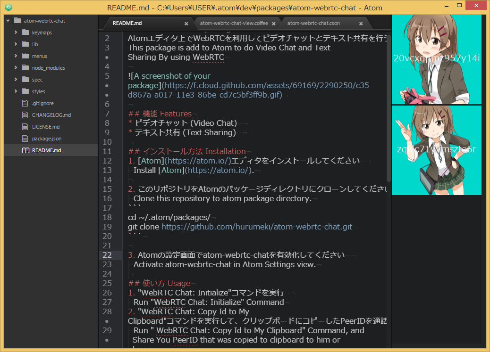

# atom-webrtc-chat package
Atomエディタ上でWebRTCを利用してビデオチャットとテキスト共有を行うAtomパッケージです。  
This package is add to Atom to do Video Chat and Text Sharing By using WebRTC



※映像を使用しない音声チャットの場合に、[プロ生ちゃんダミー画像生成サービス](http://dimg.azurewebsites.net/)（© 2011-2015 プログラミング生放送）を使用しています。

## 機能 Features
* ビデオチャット (Video Chat)  
* テキスト共有 (Text Sharing)  

## インストール方法 Installation
1. [Atom](https://atom.io/)エディタをインストールしてください  
  Install [Atom](https://atom.io/).

2. このリポジトリをAtomのパッケージディレクトリにクローンしてください  
  Clone this repository to atom package directory.
```
cd ~/.atom/packages/
git clone https://github.com/hurumeki/atom-webrtc-chat.git
```

3. Atomの設定画面でatom-webrtc-chatを有効化してください  
  Activate atom-webrtc-chat in Atom Settings view.

## 使い方 Usage
1. "WebRTC Chat: Initialize"コマンドを実行  
  Run "WebRTC Chat: Initialize" Command

2. "WebRTC Chat: Copy Id to My Clipboard"コマンドを実行して、クリップボードにコピーしたPeerIDを通話したい相手に共有  
  Run " WebRTC Chat: Copy Id to My Clipboard" Command, and Share You PeerID that was copied to clipboard to him or her

3. 相手側でも、"WebRTC Chat: Initialize"コマンドを実行  
  He or She Run "WebRTC Chat: Initialize" Command

4. 相手側で、"WebRTC Chat: Call"コマンドを実行して、表示されたダイアログに2.で共有されたPeerIDを入力して通話を開始  
  He or She Run "WebRTC Chat: Call", and input PeerID(shared by No.2), then call is started  

|Key|Events|Description|
|:-:|:-:|:-:|
|Ctrl + Alt + b Ctrl + Alt + i|WebRTC Chat: Initialize|Peerを初期化します（以下のコマンドを実行する前に必ず実施してください）。<br>Initialize Peer (You must do this command before do below commands)|
|Ctrl + Alt + b Ctrl + Alt + x|WebRTC Chat: Copy My Id to  Clipboard|PeerIDをクリップボードにコピーします。このPeerIDを通話したい相手に知らせてください。 <br>Copy N My PeerID to clipboard. share this PeerID who you want to call|
|Ctrl + Alt + b Ctrl + Alt + c|WebRTC Chat: Call|相手のPeerIDを入力するダイアログがでます。相手のPeerIDを入力して通話を始めます。<br> Open dialog to input remote PeerId, and Call is started|
|Ctrl + Alt + b Ctrl + Alt + shift + C|WebRTC Chat: Close|通話を終了します。<br>Close Call|
|Ctrl + Alt + b Ctrl + Alt + t|WebRTC Chat: Toggle View|チャットを非表示にします <br>Hide the Chat View|
|Ctrl + Alt + b Ctrl + Alt + n|WebRTC Chat: Toggle Video|ビデオの共有を開始/停止します <br>Toggle Video Shareing On/Off|
|Ctrl + Alt + b Ctrl + Alt + m|WebRTC Chat: Toggle Audio|マイクの共有を開始/停止します <br>Toggle Microphone Shareing On/Off|
|Ctrl + Alt + b Ctrl + Alt + s|WebRTC Chat: Send Buffer|アクティブエディタの内容を通話相手に送信します <br>Send Text Buffer to peer|
| -|WebRTC Chat: Change Video Input Source|ビデオデバイスを切り替えます。Change video input device|
| -|WebRTC Chat: Change Audio Input Source |マイクデバイスを切り替えます。Change microphone input device|

## 設定 Settings
|Item|Default|Description|
|:-:|:-:|:-:|
|Peer Id|-|通話のためのPeer Idを指定できます。ただし、予約されるわけではありません。<br>you can set specific peer id to call. But it does not mean that id is reserved|
